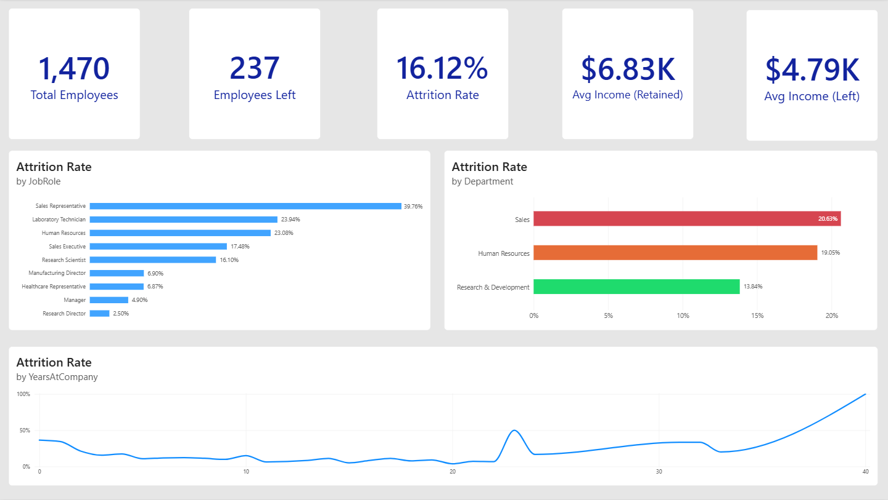
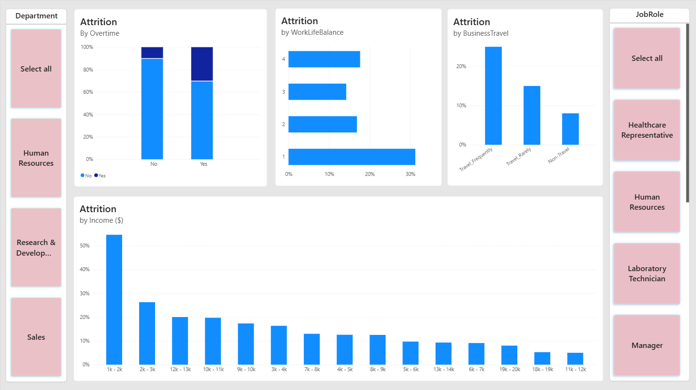
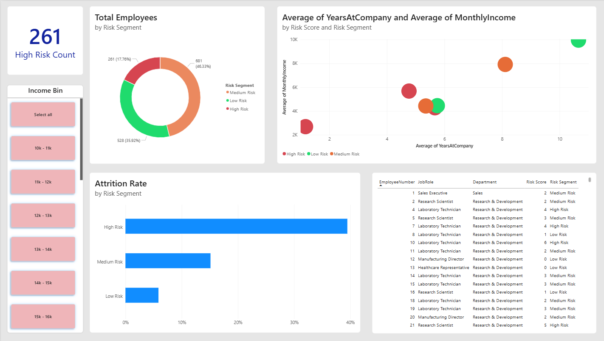
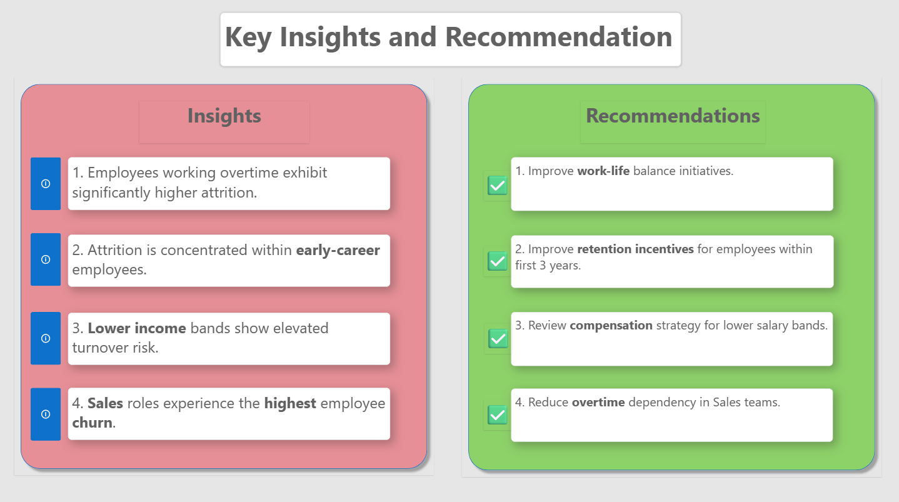

# Employee Attrition Analysis & Workforce Risk Dashboard

---

## Project Overview

Employee attrition is one of the most expensive operational challenges for organizations. High turnover increases recruitment costs, disrupts operations, reduces institutional knowledge retention, and negatively impacts workforce stability.

This project analyzes employee attrition patterns using an interactive Power BI dashboard to uncover the operational, financial, and behavioral factors contributing to employee turnover. Beyond descriptive reporting, the project introduces a custom Risk Scoring Framework to identify employees who may be at higher risk of leaving the organization.

The dashboard transforms raw HR data into actionable workforce intelligence for HR teams and business decision-makers.

---

## Executive Dashboard Preview



---

## Business Problem

Organizations often monitor attrition only at a surface level through overall turnover percentages or yearly reports. However, these metrics alone fail to explain:

- Why employees leave
- Which employee groups are most vulnerable
- Which operational factors contribute most to attrition
- How HR teams can proactively reduce workforce risk

This project addresses those gaps through interactive analytics and employee risk segmentation.

---

## Objectives

- Identify departments and job roles with the highest attrition rates
- Analyze major attrition drivers such as overtime, income, travel, and work-life balance
- Compare retained vs attrited employee compensation trends
- Segment employees into risk categories using a weighted risk-scoring model
- Provide actionable HR recommendations to improve employee retention

---

## Tools & Technologies

- **Power BI Desktop** — Dashboard development and visualization
- **Power Query** — Data cleaning and ETL transformations
- **DAX (Data Analysis Expressions)** — KPI calculations and risk-scoring logic
- **Data Modeling** — Relational model design and metric optimization

---

## Dashboard Pages

### 1. Executive Overview

Provides a high-level summary of workforce attrition across the organization.

Key metrics include:
- Total Employees
- Employees Left
- Attrition Rate
- Attrition by Department
- Attrition by Job Role
- Attrition by Years at Company
- Average Income Comparison (Left vs Retained)


---

### 2. Attrition Drivers Analysis

Analyzes the operational and behavioral factors associated with employee turnover.

This page explores:
- Attrition by Work-Life Balance
- Attrition by Business Travel
- Attrition by Overtime
- Attrition by Income Bands
- Department and Role-level filtering



---

### 3. Workforce Risk Segmentation

Introduces a predictive-style risk segmentation framework to classify employees into:
- High Risk
- Medium Risk
- Low Risk

The model evaluates employees using multiple attrition indicators including:
- Overtime exposure
- Job satisfaction
- Monthly income
- Years at company

This enables HR teams to proactively identify vulnerable employees before attrition occurs.



---

### 4. Insights & Recommendations

Final business summary page consolidating major findings and operational recommendations.

Core recommendations include:
- Reduce overtime dependency
- Improve work-life balance initiatives
- Strengthen early-career retention programs
- Review compensation strategy for lower-income employees
- Conduct proactive stay interviews for high-risk employees



---

## Risk Scoring Methodology

To move beyond descriptive analytics, this project implements a custom employee Risk Score model.

Employees receive weighted points based on multiple attrition indicators:

| Risk Factor | Points |
|---|---|
| Overtime = Yes | 2 |
| Low Job Satisfaction | 2 |
| Monthly Income < 5000 | 1 |
| Years at Company ≤ 2 | 1 |

The final score categorizes employees into:

| Risk Score | Segment |
|---|---|
| ≥ 4 | High Risk |
| ≥ 2 | Medium Risk |
| < 2 | Low Risk |

This framework helps prioritize retention efforts toward employees showing multiple attrition indicators simultaneously.

---

## Key Insights

### 1. Overtime is the strongest attrition driver
Employees working overtime exhibit significantly higher turnover rates, indicating potential burnout and workload imbalance.

### 2. Early-tenure employees are more vulnerable
Attrition is concentrated among employees with fewer years at the company, highlighting onboarding and early-retention challenges.

### 3. Lower-income employees exhibit higher turnover
Employees in lower salary bands are substantially more likely to leave the organization.

### 4. Sales department experiences the highest attrition
Sales-related roles show the highest employee churn across the organization.

### 5. Compensation differs significantly between retained and attrited employees
Employees who left the organization had noticeably lower average income compared to retained employees.

---

## Business Recommendations

| Finding | Recommendation |
|---|---|
| High overtime-related attrition | Reduce overtime dependency and rebalance workloads |
| Early-career attrition concentration | Improve onboarding and mentorship programs |
| Lower-income employees leaving more frequently | Review compensation and retention incentives |
| High attrition in Sales | Investigate workload, targets, and operational pressure |
| High-risk employee clusters identified | Conduct proactive stay interviews and retention planning |

---

## Dataset

- **Dataset:** IBM HR Analytics Employee Attrition Dataset
- **Source:** https://www.kaggle.com/datasets/pavansubhasht/ibm-hr-analytics-attrition-dataset

---

## Files Included

```text
Employee-Attrition-Analysis/
│
├── Employee_Attrition_Dashboard.pbix
├── Employee_Attrition_Report.pdf
├── README.md
├── images/
│   ├── executive_overview.png
│   ├── attrition_drivers.png
│   ├── risk_segmentation.png
│   └── insights_recommendations.png
│
└── dataset/
```

---

## Project Highlights

- End-to-end HR analytics dashboard in Power BI
- Interactive workforce attrition analysis
- Custom DAX-based employee risk scoring framework
- Executive-level KPI reporting
- Actionable HR recommendations driven by data
- Multi-page dashboard architecture with drill-down capability

---

## Author

**Padder Zahoor**

- Data Analytics | Business Intelligence | Problem Solving
- Focused on building analytical projects that convert data into actionable business decisions

Website: https://www.padderzahoor.com
